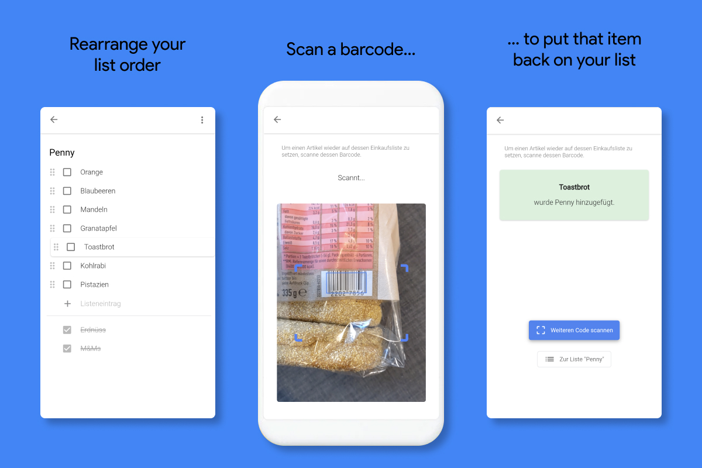

## BARCODE GROCERY LIST

**Capstone project in the course of my web development bootcamp at neuefische**

## Description

With "BarcodeGroceryList" it's easier than ever to add an item to your grocery list. You won't ever forget to buy something at the store again.

0. Set up different lists for different stores.
1. Open the integrated barcode scanner of the installed PWA via the dedicated short cut on your home screen.
2. Scan the barcode of the product you wanna add back to your list.
3. Automatically the item becomes unchecked within the allocated store's list.

## Main Features

- You can create different lists for different stores.
- You can easily change the order of items within a list via drag and drop - e.g. to arrange the items in the order they are located at the store.
- For the setup process, you just need to scan the barcode of each item only once in order to link it with the product.

## Motivation

This project was created as part of my graduation from the neuefische coding bootcamp.
I used to use the Google Keep / Notes app as a grocery list. It sattisfied all my needs and therefore I simply coppied Google's app one to one. With Google's version, however, I had the pain of not being able to put an item back on the list quickly. For some shops I had some 50 checked items in my list. When I wanted to uncheck one specific item in order to buy it the next time I went to that store, I had to navigate to the corresponding shop's list and manually go through all of the 50 items in to uncheck it. With my version, I just need to scann the barcode of the product I would like to uncheck / put back on the list and that's it! Take notes, Google :)

## Look & Feel

## Demo

A hosted version can be found here:
[Shopping](https://capstone-project.felix-horn.vercel.app/)

## Tech Stack

- React
- React-Router
- Styled-Components
- Styleguidist
- PropTypes
- React-Testing-Library / JEST
- Cypress
- PWA
- react-beautiful-dnd
- Normalized Data
- immer
- QuaggaJS

## Project setup

1. Clone my repository:

   `$ git clone git@github.com:felix-horn/capstone-project.git`

2. Install all npm dependencies:

   `$ npm install`

3. To run the app in development mode:

   `$ npm start`

   Then open http://localhost:3000 to view it in the browser.

4. To run Styleguidist

   `$ npm run styleguide`

5. To run unit and component tests:

   `$ npm run test`

6. To run Cypress tests:

   `$ npm run cy:run`
   `$ npm run cy:open`

7. Create a build ready for deployment:

   `$ npm run build`

## License

MIT © Felix Horn

---

[neuefische](https://github.com/neuefisch)
